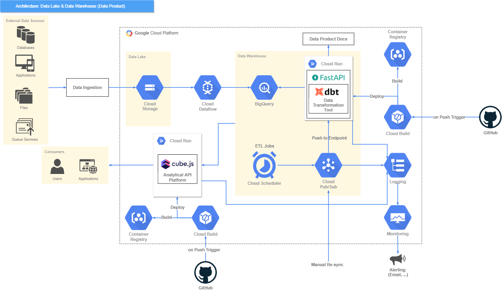

# data_warehouse_bq_dbt
This is a project of data warehouse built on BigQuery using dbt with serverless.

## Data Structure


## Local Build using dbt
1. Add service account crediental file in folder `/secrets` with file naming `dbt-admin_credential.json`
2. Run Docker Container
    ```zsh
    sh ./dbt_start.sh
    ```
3. Run DBT commands in Docker Container 
    ```zsh
    cd /dbt
    # Example (can refer to dbt_script.sh)
    dbt debug --profiles-dir .
    ```

4. (Optional) Generate DBT documentations
    ```zsh
    dbt docs generate --profiles-dir .
    dbt docs serve --profiles-dir .
    ```
    >   To access from your browser, navigate to:  http://localhost:8080

-   Reference:
    -   Structure / Coding Style
        -   [DBT Style Guide](https://github.com/dbt-labs/corp/blob/master/dbt_style_guide.md)
        -   [How we structure our dbt projects](https://discourse.getdbt.com/t/how-we-structure-our-dbt-projects/355)
    -   DBT with BigQuery
        -   [BigQuery Configurations](https://docs.getdbt.com/reference/resource-configs/bigquery-configs#use-project-and-dataset-in-configurations)
        -   [Benchmarking: Incremental Strategies](https://discourse.getdbt.com/t/benchmarking-incremental-strategies-on-bigquery/981)
        -   [Incremental Changes with Insert Overwrite](https://discourse.getdbt.com/t/bigquery-dbt-incremental-changes/982)
        -   [BigQuery Merge Statement](https://cloud.google.com/bigquery/docs/reference/standard-sql/dml-syntax#merge_statement)
    -   DBT Guidance
        -   [DBT Best Practices](https://docs.getdbt.com/docs/guides/best-practices)
        -   [DBT Methods](https://docs.getdbt.com/reference/node-selection/methods)
        -   [What are the dbt commands you run in your production deployment](https://discourse.getdbt.com/t/what-are-the-dbt-commands-you-run-in-your-production-deployment-of-dbt/366)
        -   [Understanding State (Advanced)](https://docs.getdbt.com/docs/guides/understanding-state)
        -   [Defer (Advanced)](https://docs.getdbt.com/reference/node-selection/defer)